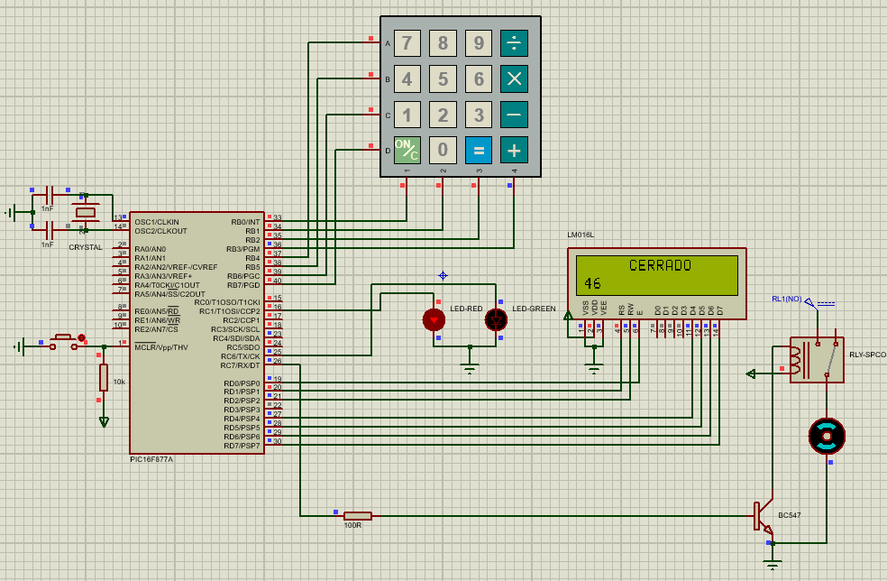

# PIC16F877A Contraseña con Teclado Matricial

Este proyecto utiliza un microcontrolador PIC16F877A, El usuario debe de ingresar una contraseña para que el motor se pueda mover lo que simularia abrir alguna puerta, 
la contraseña se puede cambiar por otra si el usuario desea, pero para poderla cmabiar debe de ingresar la contraseña anterior 

## Componentes
- Microcontrolador: PIC16F877A
- Motor
- Teclado Matricial
- Pantalla LCD
- Led Rojo
- Led Verde
- Relevador
- Transistor

## Herramientas de Desarrollo
- Proteus 11 para la simulación
- Lenguaje de programación: C

## Archivos del Proyecto
- Código fuente: "Password.c"
- Archivo .hex para la programación del microcontrolador
- Archivo .cof para depuración

## Diagrama de Conexión
- Se incluye una imagen PNG que muestra el diagrama de conexión entre los componentes
- Tambien se añade la simulacion realizada en Proteus

-------------------------------

# PIC16F877A Password with Matrix Keyboard+

This project uses a PIC16F877A microcontroller. The user must enter a password for the motor to move, which would simulate opening a door.
The password can be changed to another if the user wishes, but in order to change it they must enter the previous password.

## Components
- Microcontroller: PIC16F877A
- Engine
- Matrix keyboard
- LCD screen
- Red LED
- Green LED
- Relay
- Transistors

## Development tools
- Proteus 11 for simulation
- Programming language: C

## Project files
- Source code: "Password.c"
- .hex file for microcontroller programming
- .cof file for debugging

## Connection diagram
- A PNG image is included showing the connection diagram between the components
- The simulation carried out in Proteus was also added
  
-------------------------------

 

